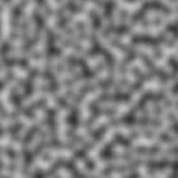
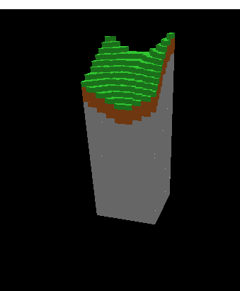
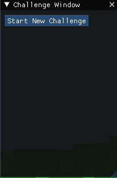
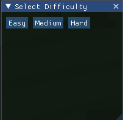
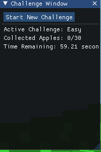

# Java Voxel Engine

Eine Voxel Engine in Java mit custom Chunk und Perlin noise basierter terrain generation.
Ein Imgui fenster als overlay.
Und ein parr challenges zum ausprobieren (man muss äpfel sammeln)

---

## 🚀 Entwicklungsverlauf

Hier siehst du die wichtigsten Schritte der Engine-Entwicklung in der Reihenfolge ihres Entstehens:

### 1. Grundlegende Voxel-Erzeugung

### 2. Perlin-Rausch Terrain einbauen
Perlin Noise:

Fertiger Chunk:

### 3. Versuch Grosse mengen zu generieren

### 4. Optimierung durch entfernen von Steinen

### 5. First-Person-Steuerung

### 6. ImGui-Integration

### 7. Challenge-Fenster

### 8. Schwierigkeitsauswahl

### 9. Challenge-Info

### 10. Baum-Generierung

### 11. Optimiert:

### 12. Beim weiterentwickeln des Apfelspiels einen fehler gefunden
Man kann sehen, dass obwohl ich in dem -64 -64 chunk bin,
die chunk local coords -1 beträgt obwohl diese nur 0-63 betragen dürften.

Versucht durch anzeigen des Rays herauszufinden was falsch ist, keine ahnung 

---

## 🎮 Steuerung

- **Bewegung**: W/A/S/D
- **Blicksteuerung**: Rechts click + Maus bewegen
- **Cursor Escapen um Ui zu benutzen**: ESC
- **Herausforderungen starten**: Öffne das „Challenges“-Fenster im ImGui-Overlay

---

## 📺 Zwei Videos an verschidenen stellen des Development prozesses

- **Engine Walkthrough**:  
  

- **First-Person-Controller Demo**:  
  

---

## 🛠️ Architektur & Module

- **`core`**: Haupt-Spielschleife, Weltdatenstrukturen, Rendering-Pipeline.
- **`lwjgl3`**: Low-Level-Fenster- und Eingabehandling via LWJGL3-Backend.
- **`assets`**: Texturen

---

*Entwickelt von Fynn © 2025*
