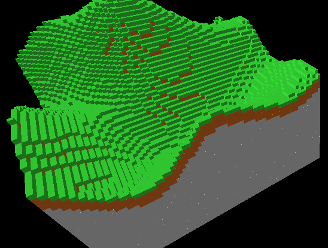
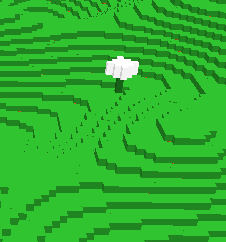

# Informatik Projekt: Voxel Engine

Dieses Projekt zeigt die Entwicklung einer Voxel Engine in Java. Hier sind die wichtigsten Implementierungsschritte und Ergebnisse:

## Implementierungsschritte

### 1. Grundlegende Voxel-Generierung

### 2. Verbesserte Generierung mit Perlin Noise

### 3. Optimierung durch Entfernen von Steinen

### 4. Vollständige Chunk-Generierung

### 5. Benutzeroberfläche Implementierung

### 6. Baumgenerierung

## Video Demonstration

Hier ist eine Video-Demonstration des Projekts:

[Video Demonstration](readme_images/JavaVoxelEngine%202025-04-17%2013-02-52.mp4)
