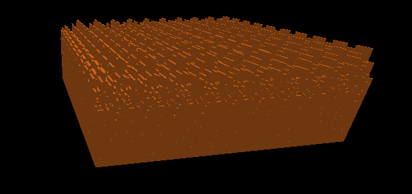
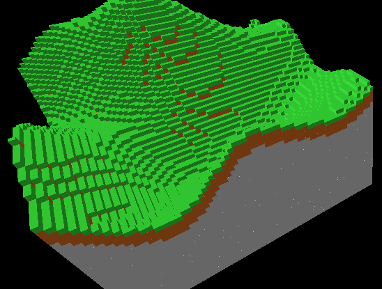
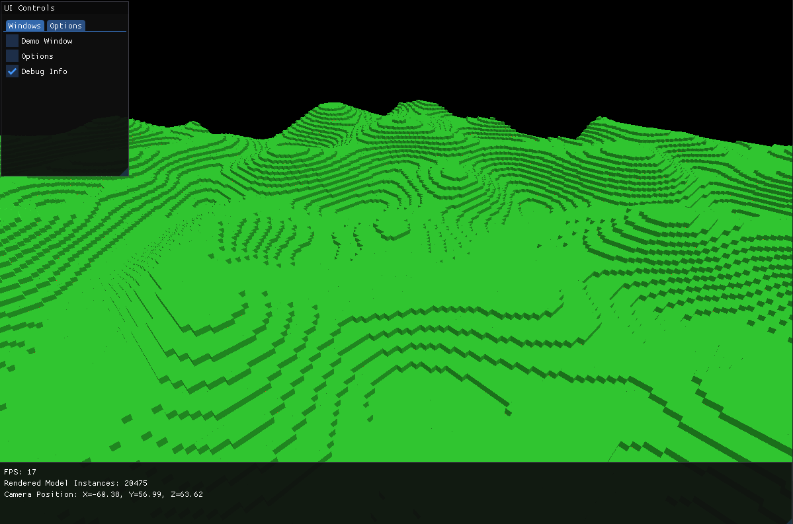

# Informatik Projekt: Voxel Engine

Dieses Projekt zeigt die Entwicklung einer Voxel Engine in Java. Hier sind die wichtigsten Implementierungsschritte und Ergebnisse:

## Implementierungsschritte

### 1. Grundlegende Voxel-Generierung

### 2. Verbesserte Generierung mit Perlin Noise

### 3. Optimierung durch Entfernen von Steinen

### 4. Vollständige Chunk-Generierung

### 5. Benutzeroberfläche Implementierung

### 6. Baumgenerierung

## Video Demonstration

Hier ist eine Video-Demonstration des Projekts:

<video width="640" height="480" controls>
  <source src="https://cdn.discordapp.com/attachments/303440391124942858/1362373722496827546/JavaVoxelEngine_2025-04-17_12-25-58.mp4?ex=680228e7&is=6800d767&hm=5d3468deadc1513ef8a6dbfd04b01baece30f91dd8e85c5a8b2de39fdbd79772&" type="video/mp4">
  Ihr Browser unterstützt das Video-Tag nicht.
</video>
