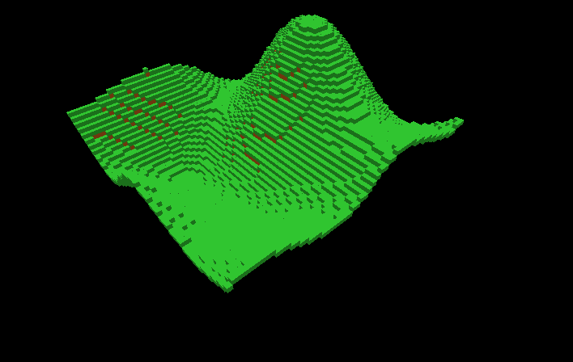

# Java Voxel Engine

Eine modulare und erweiterbare voxelbasierte Spiele-Engine in Java, basierend auf LWJGL3 und LibGDX. Ursprünglich als fortgeschrittenes Projekt für den Informatikunterricht entwickelt, demonstriert diese Engine Welterzeugung, Performance-Optimierungen, ImGui-basierte Debug-Tools und ein Mini-Spiel im Herausforderung-Modus.

---

## 🚀 Entwicklungsverlauf

Hier siehst du die wichtigsten Schritte der Engine-Entwicklung in der Reihenfolge ihres Entstehens:

### 1. Grundlegende Voxel-Erzeugung


### 2. Perlin-Rausch Terrain einbauen
Perlin Noise:


Fertiger Chunk:


### 3. Versuch Grosse mengen zu generieren


### 4. Optimierung durch entfernen von Steinen


### 6. First-Person-Steuerung


### 7. ImGui-Integration


### 8. Challenge-Fenster


### 9. Schwierigkeitsauswahl


### 10. Challenge-Info


### 11. Baum-Generierung


### 12. Optimiert:


### 13. Beim weiterentwickeln des Apfelspiels einen fehler gefunden
Man kann sehen, dass obwohl ich in dem -64 -64 chunk bin,
die chunk local coords -1 beträgt obwohl diese nur 0-63 betragen dürften.


Versucht durch anzeigen des Rays herauszufinden was falsch ist, keine ahnung 


---

## ⚙️ Erste Schritte

### Voraussetzungen

- Java Development Kit (JDK) 17 oder höher
- Git
- Gradle (Wrapper enthalten)

### Klonen und Ausführen

```bash
# Repository klonen
git clone https://github.com/LuckyMcDev/JavaVoxelEngine.git
cd JavaVoxelEngine

# Engine bauen und starten
./gradlew run
```

Das Anwendungsfenster startet automatisch. Verwende **W/A/S/D**, um dich zu bewegen, die **Maus**, um den Blick zu steuern, und **ESC**, um das ImGui-Overlay ein- oder auszublenden.

---

## 🎮 Steuerung

- **Bewegung**: W/A/S/D
- **Blicksteuerung**: Rechts click + Maus bewegen
- **Cursor Escapen um Ui zu benutzen**: ESC
- **Herausforderungen starten**: Öffne das „Challenges“-Fenster im ImGui-Overlay

---

## 📺 Zwei Videos an verschidenen stellen des Development prozesses

- **Engine Walkthrough**:  
  [](readme_images/JavaVoxelEngine%202025-04-17%2013-02-52.mp4)

- **First-Person-Controller Demo**:  
  [](readme_images/JavaVoxelEngine-new-first-person-controller-2025-04-18%2011-30-24.mp4)

---

## 🛠️ Architektur & Module

- **`core`**: Haupt-Spielschleife, Weltdatenstrukturen, Rendering-Pipeline.
- **`lwjgl3`**: Low-Level-Fenster- und Eingabehandling via LWJGL3-Backend.
- **`assets`**: Texturen, Shader und Audio-Ressourcen.

---

## 📄 Lizenz

Dieses Projekt ist lizenziert unter der Apache License 2.0. Details findest du in der [LICENSE](LICENSE)-Datei.

---

*Entwickelt von Fynn / LuckyMcDev © 2025*
