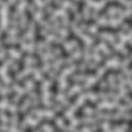
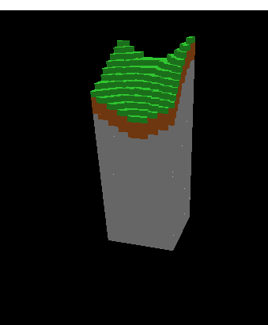
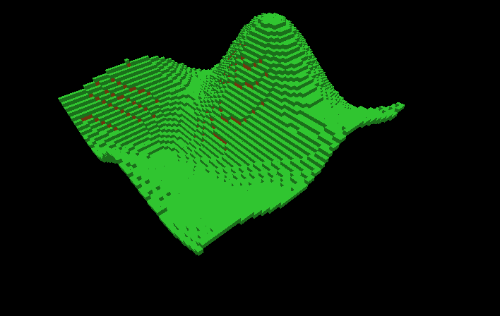
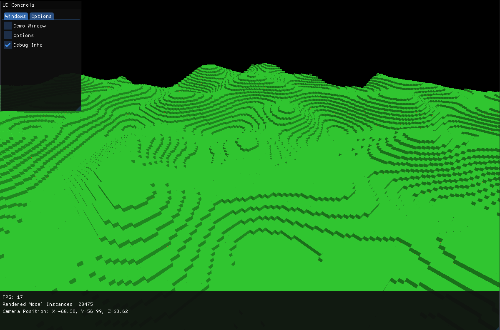
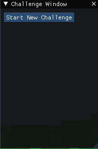
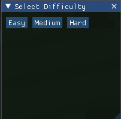
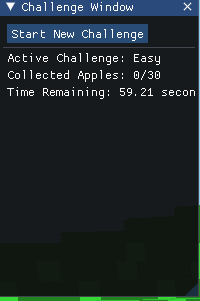
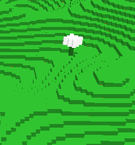
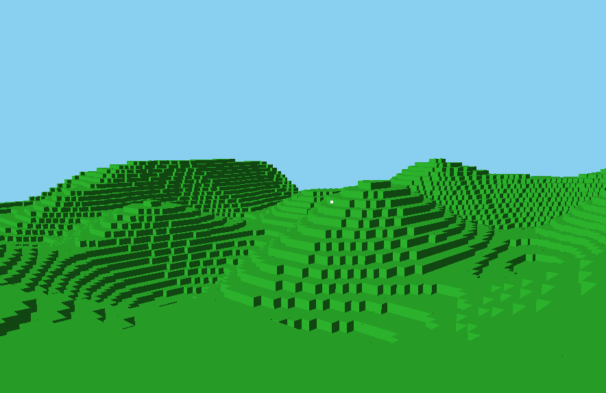
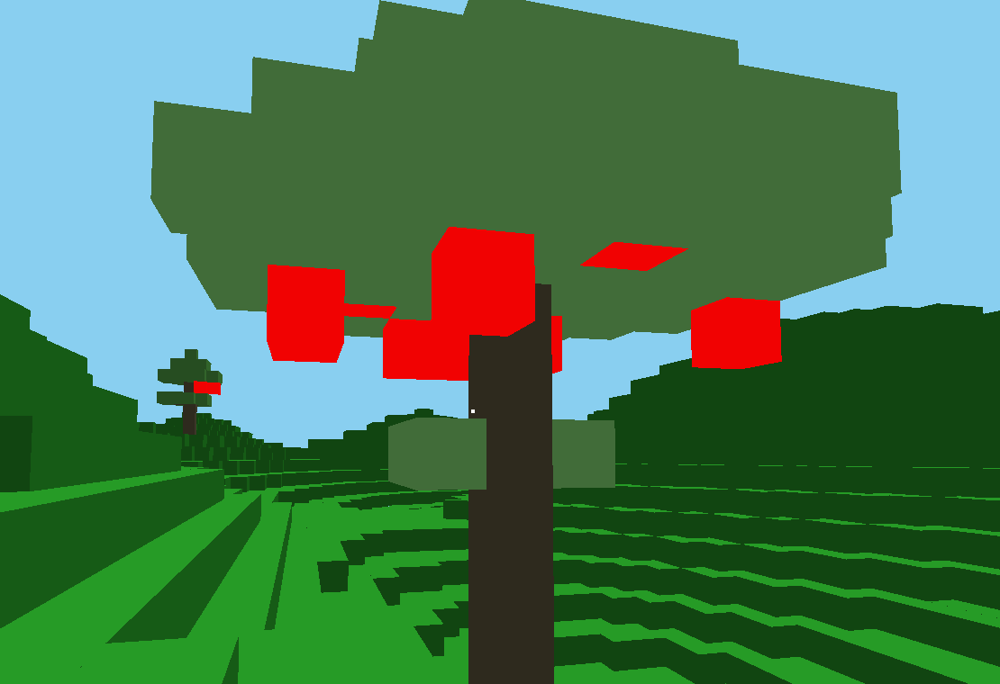

# Java Voxel Engine

Eine Voxel Engine in Java mit custom Chunk und Perlin noise basierter terrain generation.
Ein Imgui fenster als overlay.
Und ein parr challenges zum ausprobieren (man muss äpfel sammeln)


---

## 🎮 Steuerung

- **Bewegung**: W/A/S/D
- **Blicksteuerung**: Rechts click + Maus bewegen
- **Cursor Escapen um Ui zu benutzen**: ESC
- **Herausforderungen starten**: Öffne das „Challenges“-Fenster im ImGui-Overlay

---

## 🛠️ Architektur & Module

- **`core`**: Haupt-Spielschleife, Weltdatenstrukturen, Rendering-Pipeline.
- **`lwjgl3`**: Low-Level-Fenster- und Eingabehandling via LWJGL3-Backend.
- **`assets`**: Texturen und Shader Dateien

---

## 🚀 Entwicklungsverlauf

Hier siehst du die wichtigsten Schritte der Engine-Entwicklung in der Reihenfolge ihres Entstehens:

### 1. Grundlegende Voxel-Erzeugung


### 2. Perlin-Rausch Terrain einbauen
Perlin Noise:



Fertiger Chunk:



### 3. Versuch Grosse mengen zu generieren


### 4. Optimierung durch entfernen von Steinen


### 5. First-Person-Steuerung


### 6. ImGui-Integration


### 7. Challenge-Fenster


### 8. Schwierigkeitsauswahl


### 9. Challenge-Info


### 10. Baum-Generierung


### 11. Optimiert:


### 12. Beim weiterentwickeln des Apfelspiels einen fehler gefunden
Man kann sehen, dass obwohl ich in dem -64 -64 chunk bin,
die chunk local coords -1 beträgt obwohl diese nur 0-63 betragen dürften.


Versucht durch anzeigen des Rays herauszufinden was falsch ist, keine ahnung 


### 13. Herausgefunden was Falsch ist!

Mir wurde klar das irgendwas nmicht stimmt, also habe ich mir alle daten angeschaut die mit den Ray
und anderem zu tun hat. das sah dann so aus:


Als ich mir das genauer angeschaut hab, habe ich gesehen das die Position des rays nicht stimmt!
Wenn man genau hinschaut sieht man in diesem ScreenShot schon was falsch ist ;)

#### Als das herausgefunden war, habe ich den raytracer umgeschrieben:

In diesem Code kann man sehen wie ich den ray mit der position entlang gehe.


### 14. Endlich Fertig?

Ich weiss noch nicht ob ich noch ein paar mehr updates wie zum beispiel einen deffrered renderer
screib oder so etwas.

Richtig cool wie deine Readme aufgebaut ist!  
Wenn du bei **15. Shaders** weitermachen willst und noch Shader-Grundlagen + was du genau gemacht hast erklären möchtest, können wir deinen Stil so weiterziehen: Locker, ein bisschen Storytelling drin, viele Bilder/Erklärungen.

Hier ein Vorschlag, wie du den nächsten Abschnitt machen könntest:

---

## 15. Shaders

Ich hatte etwas Zeit und habe angefangen, mich mit **Shaders** zu beschäftigen.

**Was ist ein Shader überhaupt?**  
Ein Shader ist einfach ein kleines Programm, das auf der Grafikkarte läuft.  
Statt, dass die CPU Pixel oder Dreiecke malt, wird die Arbeit an die GPU ausgelagert — die kann das *viel schneller*.

Es gibt verschiedene Arten von Shadern:

- **Vertex Shader**  
  Bestimmt, wo ein Punkt (Vertex) am Bildschirm angezeigt wird.  
  ➔ Hier kann man z.B. Positionen verändern, um Objekte wackeln zu lassen oder sie größer/kleiner zu machen.

- **Fragment Shader**  
  Bestimmt, welche Farbe ein Pixel bekommt.  
  ➔ Hier passieren Dinge wie Texturen aufmalen, Beleuchtung berechnen oder Spezialeffekte.


**Was ich gemacht habe:**
- Zuerst einen super simplen Shader gebaut, der einfach nur alles schwarz gemacht hat 😅  
  

- Dann herausgefunden, dass ich die Lichtberechnung vergessen hatte.  
  ➔ Also Lighting in den Fragment Shader eingebaut!

- Ergebnis:  
  Jetzt werden Blöcke richtig schön beleuchtet 🎉

  

- Ich habe dann noch ein bisschen rumgespielt und die Äpfel ganz Rot gemacht also die farbe "eingefangen"
    und dann auf alpha 1 gesetzt.
  

**Ein mini Shader Beispiel**

Hier ein **ganz einfacher Shader**, der Blöcke einfärbt und ein bisschen Licht draufrechnet.

**Vertex Shader** (`vertex.glsl`):

```glsl
#version 330 core

layout(location = 0) in vec3 aPos;    // Position des Vertex
layout(location = 1) in vec3 aNormal; // Normale (für Lichtberechnung)

uniform mat4 model;
uniform mat4 view;
uniform mat4 projection;

out vec3 FragPos;   // Weltposition des Fragments
out vec3 Normal;    // Normale zum Fragment

void main()
{
    FragPos = vec3(model * vec4(aPos, 1.0));
    Normal = mat3(transpose(inverse(model))) * aNormal;  

    gl_Position = projection * view * model * vec4(aPos, 1.0);
}
```


**Fragment Shader** (`fragment.glsl`):

```glsl
#version 330 core

in vec3 FragPos;
in vec3 Normal;

out vec4 FragColor;

uniform vec3 lightPos; 
uniform vec3 lightColor;
uniform vec3 objectColor;

void main()
{
    // Richtung vom Fragment zum Licht
    vec3 lightDir = normalize(lightPos - FragPos);
    
    // Lichtintensität (Lambert'sches Gesetz)
    float diff = max(dot(Normal, lightDir), 0.0);
    
    vec3 diffuse = diff * lightColor;
    vec3 result = (diffuse + vec3(0.1)) * objectColor; // + etwas Ambient Light

    FragColor = vec4(result, 1.0);
}
```


**Was dieser Shader macht:**
- Der **Vertex Shader** transformiert die Welt-Koordinaten korrekt auf den Bildschirm.
- Der **Fragment Shader** berechnet die Farbe basierend auf der Lichtposition und der Oberfläche des Blocks.

### 15.2 Shaders Part 2
shader sind ja cool und so deswegen habe ich noch einen hinzugefügt, nämlich einen der etwas "Fog"
hinzufügt.


Der fog wurde dann ein bissl geändert zu dem, das heisst weiter weg,
um die chunks die plötzlich eingeblendet werden zu verstecken.


### 15.3 Shaders Part 3

Der shader war gut, aber ein bisschen hart für die Augen.


Jetzt sieht es ein bisschen besser aus!

---

*Entwickelt von Fynn © 2025*
